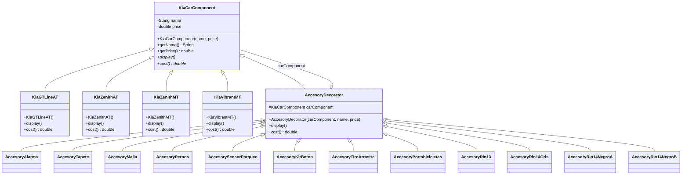

# Patron_Decorator_Automovil

Implementación en Java del **patrón Decorator** aplicado a la configuración de un
automóvil Kia: se parte de un vehículo base y se le envuelven dinámicamente
accesorios que amplían su descripción y su precio.

## ¿Qué hace?

El programa permite construir un coche y "decorarlo" con tantos accesorios como
se quiera, sin crear una subclase por cada combinación posible
(`KiaGTLineAT + Alarma + Tapete`, etc.).

- Un **componente** (el coche) conoce su propio nombre y precio.
- Un **accesorio** envuelve a otro componente, delega en él su comportamiento y
  añade el suyo.
- El precio total y la descripción se calculan recorriendo la cadena de
  decoradores, de dentro hacia afuera.

Salida real de `App` (el coche base, el mismo coche con alarma y, por último,
con alarma + tapete):

```
Car Model: Kia GT Line AT, Price: 7.299E7 COP
Total Cost: $7.299E7

Car Model: Kia GT Line AT, Price: 7.299E7 COP
Accesory: Alarma Matrix General 2 Controles, Price: 205000.0 COP
Total Cost: $7.3195E7

Car Model: Kia GT Line AT, Price: 7.299E7 COP
Accesory: Alarma Matrix General 2 Controles, Price: 205000.0 COP
Accesory: Tapete Tres Piezas Alfombra Picanto (2018 - 2023), Price: 92000.0 COP
Total Cost: $7.3287E7
```

## El patrón

- **Component** (`KiaCarComponent`): define la interfaz común: `display()` y
  `cost()`, además de `getName()` / `getPrice()`.
- **ConcreteComponent**: las clases `Kia*` (GT Line AT, Zenith AT, Zenith MT,
  Vibrant MT), que implementan `display()` y `cost()` con su propio precio.
- **Decorator** (`AccesoryDecorator`): hereda de `KiaCarComponent` y contiene un
  `KiaCarComponent` (`carComponent`). En `display()` primero delega al componente
  envuelto y después imprime su propia información; en `cost()` suma su precio al
  del componente envuelto: `carComponent.cost() + getPrice()`.
- **ConcreteDecorator**: cada accesorio (`AccesoryAlarma`, `AccesoryTapete`,
  `AccesoryRin13`, ...) extiende `AccesoryDecorator`, define su nombre y precio, y
  llama a `super(...)` con el componente a decorar.

Gracias a que `AccesoryDecorator` **extiende** el componente en vez de
implementar una interfaz aparte, los decoradores son intercambiables con el
coche base: cualquier `KiaCarComponent` puede envolverse y ser usado como
`KiaCarComponent` sin cambios en el cliente.

### Cómo se compone

```java
KiaCarComponent auto = new KiaGTLineAT();               // componente concreto
auto = new AccesoryAlarma(auto);                        // decorador
auto = new AccesoryTapete(auto);                        // decorador
auto = new AccesoryRin14NegroA(auto);                   // decorador

auto.display();                 // coche + alarma + tapete + rines
System.out.println(auto.cost()); // suma de todos los precios
```

## Diagrama de clases



## Estructura de carpetas

```
Patron_Decorator_Automovil/
├── src/
│   ├── App.java                        # Punto de entrada: compone y muestra el resultado
│   └── models/
│       ├── Components/                 # Componentes concretos (los coches)
│       │   ├── KiaCarComponent.java    # Component (abstracto)
│       │   ├── KiaGTLineAT.java
│       │   ├── KiaZenithAT.java
│       │   ├── KiaZenithMT.java
│       │   └── KiaVibrantMT.java
│       └── decorators/                 # Decoradores (los accesorios)
│           ├── AccesoryDecorator.java  # Decorator base
│           ├── AccesoryAlarma.java
│           ├── AccesoryTapete.java
│           ├── AccesoryMalla.java
│           ├── AccesoryPernos.java
│           ├── AccesorySensorParqueo.java
│           ├── AccesoryKitBoton.java
│           ├── AccesoryTiroArrastre.java
│           ├── AccesoryPortabicicletas.java
│           ├── AccesoryRin13.java
│           ├── AccesoryRin14Gris.java
│           ├── AccesoryRin14NegroA.java
│           └── AccesoryRin14NegroB.java
├── bin/                                # Clases compiladas (.class)
├── .vscode/settings.json               # Rutas de fuentes y salida de Java
└── README.md
```

`src` contiene el código fuente, `bin` las clases compiladas y `lib` (no
utilizada en este proyecto) las dependencias externas. La configuración de
compilación está en `.vscode/settings.json`.

## Ejecución

Sin dependencias externas, con el JDK instalado:

```bash
javac -d bin src/App.java src/models/Components/*.java src/models/decorators/*.java
java -cp bin App
```

O bien, Visual Studio Code con la extensión *Extension Pack for Java* y el botón
*Run* sobre `App.java`.

## Añadir un accesorio nuevo

Basta con crear una clase en `models/decorators/` que extienda
`AccesoryDecorator`, pase su nombre y precio a `super(...)` y llame a
`super.display()`:

```java
public class AccesoryMiAccesorio extends AccesoryDecorator {
    public AccesoryMiAccesorio(KiaCarComponent carComponent) {
        super(carComponent, "Mi Accesorio", 250000.0);
    }

    @Override
    public void display() {
        super.display();
    }
}
```

Se puede envolver en cualquier orden y tantas veces como sea necesario.
